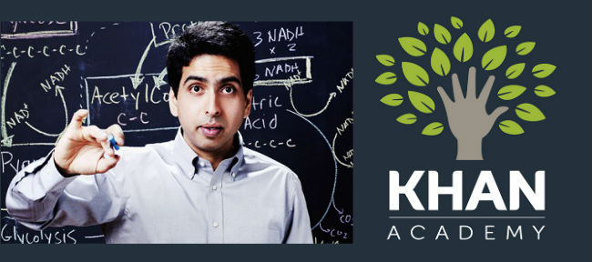

# La Classe inversée coucou
### * &ldquo; Des intentions aux outils de captation vidéo &rdquo;*
Atelier Canopé de Nantes

---

1. The Flipped Classroom
2. Une&nbsp;vieille&nbsp;idée&nbsp;revisitée&nbsp;avec&nbsp;le&nbsp;numérique
3. Qu'est-ce qu'on inverse ?
4. Des capsules vidéos
5. Stratégies pour l'engagement des élèves
6. Les motivations des enseignants
7. Positionnement de l'institution
8. Réaliser ses capsules vidéos
10. Atelier technique

---
# 1. The Flipped Classroom

---
 <!-- .slide: data-background="media/img/oldschool0.jpg" -->
#&ldquo; Lectures in class
# & 
#homework at home &rdquo;

---
 <!-- .slide: data-background="media/img/oldschool1.jpg" -->
#&ldquo; Lectures at home
# & 
#homework in class &rdquo;

---
##Du face-à-face au côte-à-côte

Externaliser la partie transmissive du cours   pour amplifier les interactions dans la classe

*&ldquo; On apprend toujours seul mais jamais sans les autres &rdquo;*

---
# 2. Une vieille idée revisitée avec le numérique...

---
##1990
Eric Mazur, Pr. de physique à Harvard

---
##2007
Jonathan Bergmann et Aaron Sams,  deux enseignants d’un lycée rural du Colorado

---
##2010
Salmon Khan et [La Khan Academy](https://fr.khanacademy.org/math/fr-sixth-grade-math) en 2010

---
##Et bien avant, en France ! 
1985, la comédie &ldquo; P.R.O.F.S. &rdquo;

<iframe class='stretch' src='http://www.youtube.com/embed/KQYwcJ3IBAM#t=1455'  frameborder='0' allowfullscreen></iframe>

---
##Et encore bien plus loin... 

---

# 3. Qu'est-ce qu'on inverse ?

---
La classe inversée par Marcel Lebrun 
<iframe class='stretch' src='http://www.youtube.com/embed/1PAoyUzgW-w' frameborder='0' allowfullscreen></iframe>

---
La « flipped taxonomie » ou l’inversion de la pyramide des compétences
<iframe class='stretch' src='http://www.youtube.com/embed/jP0C4tg6FVI' frameborder='0' allowfullscreen></iframe>

---

<!-- .slide: data-background="media/img/bloom.svg" -->

---
[Une classe inversée sur la classe inversée](http://claco.univ-lyon1.fr/workspaces/7513/open/tool/home/tab/6329)
<iframe class="stretch" src='http://claco.univ-lyon1.fr/workspaces/7513/open/tool/home/tab/6329' />

---
# 4. Des capsules vidéos...

---
## Quelques réalisations

| | | 
|-|-|
| information parents | vidéo et questionnaire | 
|<iframe class='stretch' src='http://www.youtube.com/embed/vmtDdxAeNaQ' frameborder='0' allowfullscreen></iframe>|<iframe class='stretch' src='http://www.youtube.com/embed/vF388EX_27s' frameborder='0' allowfullscreen></iframe>|
| vidéo diaporama | professeur acteur | 
|<iframe class='stretch' src='http://www.youtube.com/embed/T69VBZnNajY' frameborder='0' allowfullscreen></iframe>|<iframe class='stretch' src='http://www.youtube.com/embed/WFGJdBLhBwg' frameborder='0' allowfullscreen></iframe> |

---
## Quelques données...

- Chaque minute YouTube collectionne 5 jours de vidéos

<embed class="stretch" wmode="transparent" allowscriptaccess="sameDomain"  pluginspage="http://www.adobe.com/go/getflashplayer" quality="high" src="media/swf/socmedcounter.swf" type="application/x-shockwave-flash"></embed>

---
... dont un grand nombre réalisées par des jeunes

<iframe class='stretch' src='http://www.youtube.com/embed/YGC85AU0gRU' frameborder='0' allowfullscreen></iframe>

---
## Youtube, premier réseau social en France

- En moyenne les enfants de 7 à 12 passent 3h10 par jour sur les écrans, tandis que les adolescents y passent 4h20. (Ipsos/Etude Connect 2014) 

- 91% utilisent internet pour regarder des vidéos 

- **L'accès aux plateformes de partage vidéo est bloqué dans beaucoup d'établissements scolaires** <!-- .element: class="fragment highlight-red" -->

---
# 5. Des stratégies pour l'engagement des élèves

---

---

<!-- .slide: data-background="media/img/kolb.svg" -->

---
## The In-Class Flipp

<iframe class='stretch' src='http://www.youtube.com/embed/hhq3Yn_QgIA' frameborder='0' allowfullscreen></iframe>

---

<!-- .slide: data-background="media/img/ltc.svg" -->

---
# 6. Les motivations des enseignants

---
##Identité et liberté pédagogique

- plasticité du concept

- technologie absente de la classe

- travail didactique dans sa discipline

- individualisation pédagogique en classe

- activité sociale sur le web

- une mise en oeuvre qui vient de la base

---
# 7. Positionnement de l'institution

---
##Observation ou accompagnement ?

- Quels sont les modèles d'apprentissage sous-tendus par l'organisation spatiale et l'effectif de la classe ?

- Quels accès aux plateformes de streaming vidéo ou au BYOD dans les établissements pour nos élèves ?

- Quel matériel de captation vidéo disponible dans les établissements ?

- Quel service public de streaming vidéo pour les enseignants ?

---
[Une initiative à l'Espé de l'académie de Strasbourg](http://espe-formation.unistra.fr/webdocs/ci/)
<iframe class="stretch" src='http://espe-formation.unistra.fr/webdocs/ci/' />

---
# 8. Réaliser ses capsules vidéos

---
## Des outils pour filmer vos tutoriels

- ##[OpenBroadcaster](https://obsproject.com/) & [PicPick](http://www.picpick.org/en/)

- ##[Open-Sankoré](http://open-sankore.org/fr)

- ##[Explain Everything](http://explaineverything.com/)

---
## Des outils pour ajouter de l'interactivité

- ##[H5P](http://h5p.org/)

- ##[ChallengeU](http://challengeu.com/?l=fr)

- ##[Educanon ($)](http://www.educanon.com/)

---
# 9. Atelier technique